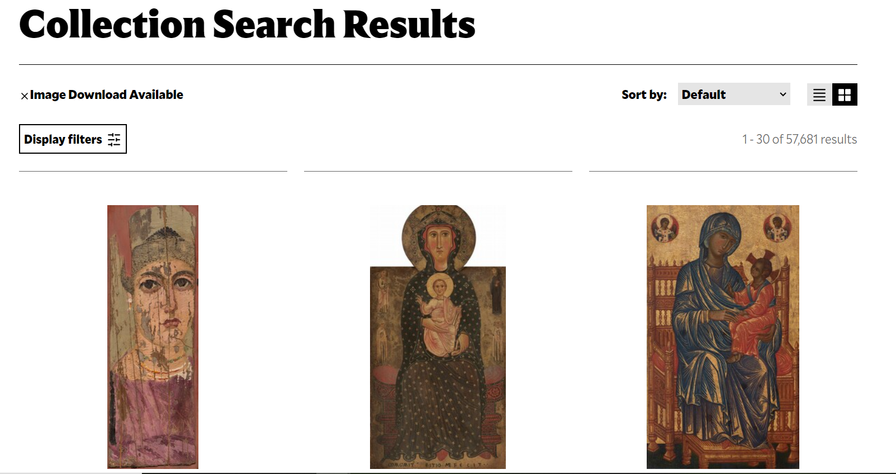
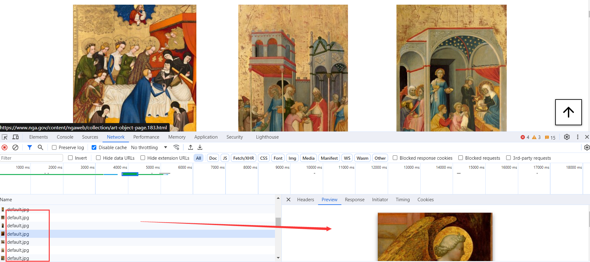
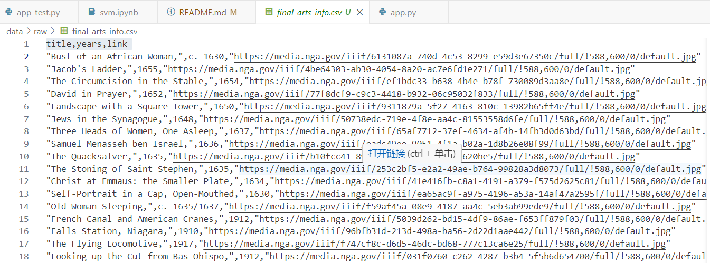

# Artwork_history_prediction

## Purpose
This project is going to collect the artworks images from [NGA](https://www.nga.gov/collection-search-result.html?sortOrder=DEFAULT&artobj_downloadable=Image_download_available&pageNumber=1&lastFacet=artobj_downloadable) and use these data to train/fine-tuning a computer vision model, which can predict the year of artwork. What's more, we provide a website user interface, you can input an image of an artwork, and it will attempt to predict the year in which the artwork was created.

## Features
- Scraped data from the NGA website.
- Building and fine-tuning a computer vision model for predicting the year of artwork.
- Providing a user-friendly graphical user interface (GUI) for users to upload images and obtain prediction results.
- Supporting various common types of artwork, such as paintings, sculptures, and photography.
- Offering detailed code and documentation for model training and prediction, facilitating further learning and customization.

## Prepare
### Environment Requirements
- Python 3.8+
- Required dependencies (see requirements.txt)

### Installation Steps
After you fork and git clone the project, You should do the following steps:
1. Prepare for the virtual environment `python -m venv venv`
2. Activate virtual environment.  Windows:`venv\Scripts\activate`, MacOS or Linux:`source venv/bin/activate`
3. Install required packages `pip install -r requirements.txt`

## Stages

### Data Collection and Preprocessing

1. Use a web scraper script based on `selenium` to collect artwork data from the NGA website (https://www.nga.gov/) and save it in an appropriate format, such as CSV. 

Due to the reason that NGA uses `JavaScript` and `Ajax` to generate content, using the `http.request` library will only retrieve the initial static HTML content and won't capture dynamically generated data. `Selenium`, by simulating user interactions with a browser, can load and execute JavaScript to retrieve the complete page content. Therefore, we get these images one by one using selenium.

2. Preprocess the scraped data, including image processing and data cleaning. Ensure that the images in the dataset align with their corresponding year labels.

    2.1.  Firstly, we got the csv file that includes header columns of title, years, link. 
    

    2.2 Clean them and got the corresponding label(year) with local image files'name
    